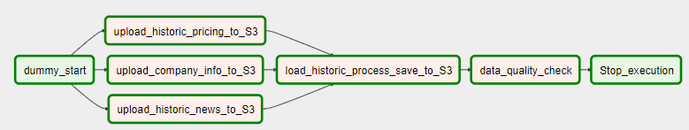
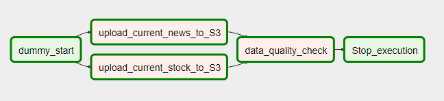

# Data Engineering Nanodegree Capstone Project: Stock Market Anaysis ETL
## Scoping the Project
### Project Overview
The purpose of this project is build data models (analytical tables) in preparation for data analysis and building machine learning models for Stock Market prediction. This project will utlized skills learning in Udacity Data Engineering Nanodegree, including storing data to S3, building data lake and ETL pipelines using Airflow. The project is developed in AWS ClouldFormation EC2 instance. 

### Steps taken in the project
* Step 1: Upload historic raw data to S3 buket
    * Download stock pricing, stock news, and compnay information data from kaggle (see datasets source for details) to EC2 machine. Need Kaggle API installed in order to download from EC2 environment
   * Upload historic raw data to s3://stock.etl/raw-historic-data/.

* Step 2: Retrieve historic raw data from S3 and process data into analytic tables 
     * Retrieve company info, historic stock pricing, historic news data from S3, 
     * Process and combine the data using Pandas
     * Save processed data back to S3 individual stock to JSON format. 
     * Perform data quality check for empty files or missing files
     * The code was developed in Jupyter Notebook `stock_predict_prep_etl.ipynb`
     * Copy and modify codes into python files and create DAG file for pipepline. Since they are historic data, the DAG only need run once. A compelted DAG of the historic stock ETL is shown below. 
     
 
 * Step 3: Given a list of stock names, scrape most recent stock price and news data
    * Pull stock data using Yahoo Finance `yfinance` package
    * Scrape Reddit news data following instructions on https://www.storybench.org/how-to-scrape-reddit-with-python/
    * Save processed data back to S3 in a date lake structure, partitioned by date and to either 'stock' or 'news' folder
    * Perform data quality check for empty files or missing files 
    * The code was developed in Jupyter Notebook `Data_Model_etl.ipynb`
    * Copy and modify codes into python files and create DAG file for pipepline. Since they are current data, the DAG runs every morning 5:30AM to publish new data. Alls the saved new data can become future's historical data for training.
    * A compelted DAG of the current stock ETL is shown below. 
     

### Purpose of the final data model
The final data models, resides in S3 data lake structures, will be used to predict next day's stock market (rise or drop). The machine learning model will be trained and tested on historical data, using news of each, stock closing price, technical indictors as well as company information. The current stock pricing data and most recent (24 hours) news will be input to the machine learning model for prediction. A use case for this is that given a list of 10 stocks, we pull historical data, which already has company info and news build in the dataset. We use the dataset to train ML models. To predict each stock rise or drop, apply the model to current data. Also, we can cross compare the 10 stocks and find the stock with the best return, which needs more analysis and modeling.   

## Addressing other Scenarios
* The data was increased by 100x. First I used pandas to process the data. Though it is on EC2, but processing and transfering to S3 for 
60 million lines of data is still slow (>1 hour). Later I spun up EMR and used Spark. which was much faster (<20mins). This is why the notebook was developed in EMR cluster in PySpark environment. If the data increased by 100x, Spark and EMR will definitely suitable for the job.
* The pipelines would be run on a daily basis by 7am every day. The DAG developed in this project runs in the morning everyday already to populate curernt stock and news data, which will be used for prediction, also stored to used for future training.
* The database needed to be accessed by 100+ people. The data are stored in S3 in Json format. S3 provides easy and secured way for large group of people to share, access and management data. Json format is also very easy to use. 

## Defending Decisions
* Tools and technologies: In this project, AWS Clouldformation, EMR, S3, Apache Airflow and Spark were used for loading, processing and uploading large amount of data. These tools are well suited for parrel-processing and pipeline the jobs with a lot of flexibility. 
* Data Model: The data model are stored in a data lake structure. The reason for that is that for this particular purpose of stock prediction, the data structures are simple, mostly time-series data. When we do training, we need the data to be loaded and accessed fairly quickly and doesn't need to go through a lot of transformations. We also need flexibility of the data and schema-on-read access. Therefore data lake would be a better choice here. 
Below is the data lake structure for historic and current stock/news architecture

## Execution and Results
Please find the details in the `stock_predict_prep_etl.ipynb` and `Data_Model_etl.ipynb` files. For a brief summary:
- Data are obtained from five resources: stock historical data, news data and compnay info from three separated Kaggle dataset, current stock pulled from Yahoo finance and current news scraped from Reddit. 
- Here I used 7000+ stock files with total of 60 million lines of data
- data format including csv, txt, API and zip. 
- See above images for resulted data models in S3, expressed in a dictionary way: {"historical data combined": "stock.etl/historic.combined", "current stock": "stock.etl/current/date/stock",  "current news": "stock.etl/current/date/news"}. current data are partitioned by date. Company info are combined with historic data and can be extract from there is needed (also in the zip file). For machine learning prupose of stock prediction, the data model is appropriate.
- There are two quality checks: check for total number of files equal desired number. Also check the smallest file to make sure no empty files.

## Datasets Source
- Stock news data 2008-2016: https://www.kaggle.com/aaron7sun/stocknews
- Stock Market Data 2010-2017: https://www.kaggle.com/borismarjanovic/price-volume-data-for-all-us-stocks-etfs
- Information about public companies that are being traded in US Stock market: https://www.kaggle.com/vaghefi/robinhood
- Current One month stock pricing data: pulled from Yahoo Finance
- Most Recent top 25 world's news data: from Reddit https://www.reddit.com/r/worldnews/top/

## Setup
- Python Package: airflow, s3fs, pandas, yfinance, pyarrow, praw
- API: 
   * Kaggle API 
      - install kaggle api https://github.com/Kaggle/kaggle-api
      - Add `kaggle` path to system variable `PATH=$PATH:/path/to/file`
   * Reddit API: https://praw.readthedocs.io/en/latest/getting_started/quick_start.html

 - Development enviroment: AWS Cloudformation EC2 instance: https://aws.amazon.com/blogs/big-data/build-a-concurrent-data-orchestration-pipeline-using-amazon-emr-and-apache-livy/
   

