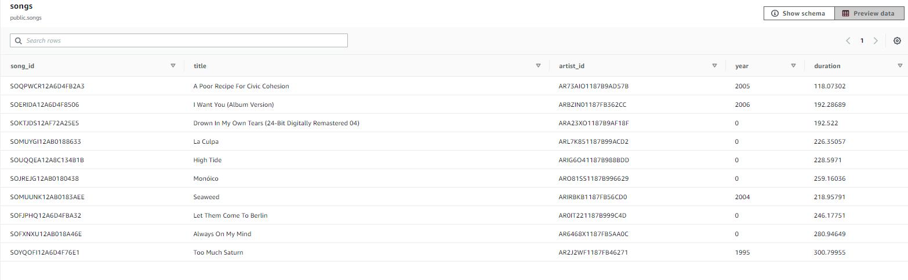

# Summary of the Project 

## Project Introduction

In this project, we will help a music streaming startup, Sparkify, to move their processes and data onto the cloud. We will build database tables for their analytics team to continue finding insights in what songs their users are listening to.

They have two type of datasets, both are located in AWS S3 buckets
1. Song Dataset: this is a subset of real data from the Million Song Dataset. Each file is in JSON format and contains metadata about a song and the artist of that song. The files are partitioned by the first three letters of each song's track ID. 

   Example of file `s3://udacity-dend/song_data/A/B/C/TRABCEI128F424C983.json` 
   contains `{"num_songs": 1, "artist_id": "ARJIE2Y1187B994AB7", "artist_latitude": null, "artist_longitude": null, "artist_location": "", "artist_name": "Line Renaud", "song_id": "SOUPIRU12A6D4FA1E1", "title": "Der Kleine Dompfaff", "duration": 152.92036, "year": 0}`
   
2. Event log Dataset: These are log files in JSON format generated by this event simulator based on the songs in the dataset above. These simulate app activity logs from an imaginary music streaming app based on configuration settings.The log files in the dataset are partitioned by year and month.

    Example of file `s3://udacity-dend/log_data/2018/11/2018-11-12-events.json`
    contains
    
    

## Project Task Summary

The purpose of this project is to develop an ETL pipeline for a database hosted on Redshift which accomplish the following tasks

    - extracts song and event data from AWS S3 and stages them in AWS Redshift (create staging tables) 
    - transforms data into fact and dimension tables using SQL statements to serve as analytics tables

# Project Steps and How to run the Python scripts
1. Create IAM Role ('AmazonS3ReadOnlyAccess'), Secuirty group, and Redshift Cluster (dc2.large with 1 node) as per the instructions from the course [1] 
2. Add the information to `dwh.cfg` file.
3. Complete SQL statements for `drop_table_queries` and `create_table_queries` in file `sql_queries.py`
4. Run `python create_tables.py` in Terminal to create empty tables in the created Redshift cluster. It will use the credentials listed in `dwh.cfg` to make database connections
   - Staging tables: `staging_events`, `staging_songs`
   - Fact table: `songplays`
   - Dimension tables: `users`, `songs`, `artists`, `time`
   
   After `python create_tables.py` ran, Redshift cluster showing tables have been created
   
   
5. Complete SQL statements for `copy_table_queries` and `insert_table_queries` in file `sql_queries.py`.  
6. Run `python etl.py` in Terminal. This will:
   1) Copy the data from provided S3 buckets (in `dwh.cfg`) to the two staging tables in the Redshift cluster. 
   2) Insert data to fact and dimension tables from the two staging tables
   
Screenshots showing `create_tables.py` and `elt.py` run in the terminal without errors.

# Explanation of the files in the repository
`create_table.py`: connect to the Sparkify database, drop any tables if they exist and create staging, fact and dimension tables
`etl.py`: connect to the Sparkify RedShift database, load song and log data from S3 into staging tables and then process that data into fact and dimension analytics tables in Redshift 
`sql_queries.py`: define SQL statements, which will be used by the above two python files.
`dwh.cfg`: this config files has credentials and information regarding host/endpoint name, DB name, DB user name, DB password, IAM role and provided song and event log data S3 location.  
`README.md`:  includes a summary of the project, how to run the Python scripts, and an explanation of the files in the repository, and discussions about the ETL pipeline.
`img` folder: includes supporting images used in this markdown file.

# Final Tables created in AWS Redshift ( with table screenshots)
The database schema in Redshift is star schema.

    - Fact table: songplays - records in event data associated with song plays. Attributes: songplay_id, start_time, user_id, level, song_id, artist_id, session_id, location, user_agent
    
    - Dimension Tables:
        - users: users in the app. Attributes: user_id (distkey), first_name, last_name, gender, level
        - songs: songs in music database. Attributes: song_id, title, artist_id (distkey), year, duration
        - artists: artists in music database. Attributes: artist_id (distkey), name, location, lattitude, longitude
        - time: timestamps of records in songplays broken down into specific units. Attributes: start_time (sortkey, distkey), hour, day, week, month, year, weekday
    
    - The distribution style is 'KEY' - distribute the fact table and dimension tables on their common columns. The choices of the distkey is based on how frequently it is joined and the size of the joining rows. This can minimize the impact of the redistribution step by locating the data where it needs to be before the query is run. 

Below showing the final tables after ran `etl.py` and data inserted into the tables

TABLE songplays

TABLE users

TABLE songs

TABLE artists

TABLE time

# References
[1] Udacity Data Engineer course: Introduction to Cloud Computing and AWS 
