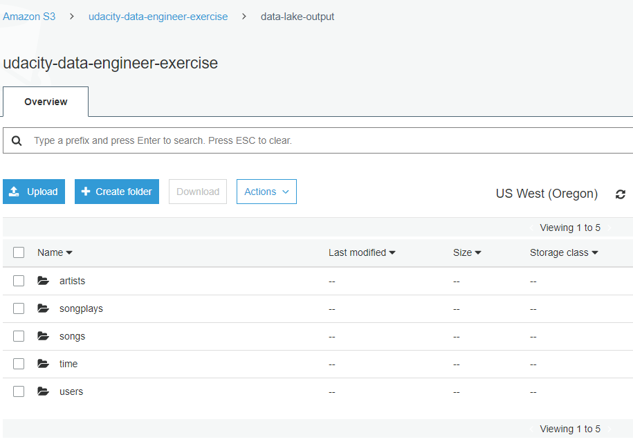
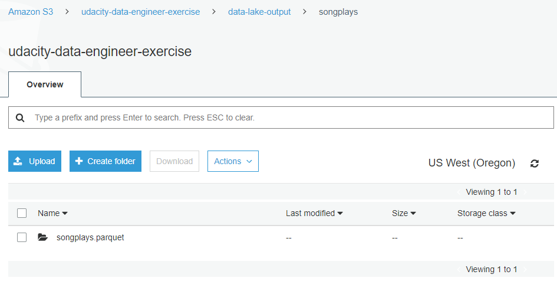

# Summary of the Project 

## Project Introduction

In this project, we will help a music streaming startup, Sparkify, to move their data warehouse onto a data lake. We will load data from S3, process the data into analytics tables using Spark, and load them back into S3.

They have two types of datasets, both are located in AWS S3 buckets
1. Song Dataset: this is a subset of real data from the Million Song Dataset. Each file is in JSON format and contains metadata about a song and the artist of that song. The files are partitioned by the first three letters of each song's track ID. 

   Example of file `s3://udacity-dend/song_data/A/B/C/TRABCEI128F424C983.json` 
   contains `{"num_songs": 1, "artist_id": "ARJIE2Y1187B994AB7", "artist_latitude": null, "artist_longitude": null, "artist_location": "", "artist_name": "Line Renaud", "song_id": "SOUPIRU12A6D4FA1E1", "title": "Der Kleine Dompfaff", "duration": 152.92036, "year": 0}`
   
2. Event log Dataset: These are log files in JSON format generated by this event simulator based on the songs in the dataset above. These simulate app activity logs from an imaginary music streaming app based on configuration settings.The log files in the dataset are partitioned by year and month.

    Example of file `s3://udacity-dend/log_data/2018/11/2018-11-12-events.json`
    contains
    
    
## Project Task Summary

The purpose of this this database in context of the startup, Sparkify, and their analytical goals are to develop an ETL pipeline for a data lake hosted on S3. There are basically three steps of completing the job
 - extracts song and event data from AWS S3 
 - process the data into analytics tables using Spark
 - load the data back into S3. 
 
# Project Steps and How to run the Python scripts
1. Generated AWS Access Key ID and Secret Access Key (in "My Security Credentials") or Created new user with S3 Read and Write Privs.  
2. Added the AWS Access Key ID and Secret Access Key to `dl.cfg` file (here the keys are not real, for demo purpose only). Note, added a headline [AWS], also changed `etl.py` code to `config['AWS']['AWS_ACCESS_KEY_ID']` and `config['AWS']['AWS_SECRET_ACCESS_KEY']`. Otherwise, it throws header error. 
3. Completed `etl.py` functions. 
4. Tested `etl.py` with a smaller dataset in S3 `'song_data/A/B/C/*.json'` and `log-data/2018/11/*.json`, test file name is `etl-small_dataset.py`. Ran `Python etl-small_dataset.py`  in the terminal without errors. Also checked S3 bucket, the output files existed in S3 with correct structures. 
5. Create EMR cluster on AWS and create a notebook `date-lake.ipynb` as per the instruction given in the lesson.
 - Created Key Pairs for SSH: https://us-west-2.console.aws.amazon.com/ec2/v2/home?region=us-west-2#CreateKeyPair:
 - Connected and Configured EMR Cluster (SSH) using puTTY (windows): https://docs.aws.amazon.com/emr/latest/ManagementGuide/emr-connect-master-node-ssh.html 
 - Spark code is executed through Livy, need to increase the time out parameter in `/etc/livy/conf/livy.conf` to eliminate `Invalid status code '400'` error. Details in https://stackoverflow.com/questions/54220381/how-to-set-livy-server-session-timeout-on-emr-cluster-boostrap
 - Change kernel to "PySpark" and retart kernel.
6. Copied code in `etl.py` to the Jupyter notebook `date-lake.ipynb`and ran.
 - Ran the notebook without errors. 
 - Verified the output files existed in S3 with correct structures.

# State and justify database schema design and ETL pipeline
The database schema is star schema.
- Fact table: songplays - records in event data associated with song plays. Attributes: songplay_id, start_time, user_id, level, song_id, artist_id, session_id, location, user_agent
- Dimension Tables:
    - users: users in the app. Attributes: user_id (distkey), first_name, last_name, gender, level
    - songs: songs in music database. Attributes: song_id, title, artist_id (distkey), year, duration
    - artists: artists in music database. Attributes: artist_id (distkey), name, location, lattitude, longitude
    - time: timestamps of records in songplays broken down into specific units. Attributes: start_time (sortkey, distkey), hour, day, week, month, year, weekday
   
# Explanation of the files in the repository
- `create_table.py`: connect to the Sparkify database, drop any tables if they exist and create staging, fact and dimension tables
- `etl.py`: connect to the Sparkify RedShift database, load song and log data from S3 into staging tables and then process that data into fact and dimension analytics tables in Redshift 
- `sql_queries.py`: define SQL statements, which will be used by the above two python files.
- `dwh.cfg`: this config files has credentials and information regarding host/endpoint name, DB name, DB user name, DB password, IAM role and provided song and event log data S3 location.  
- `README.md`:  includes a summary of the project, how to run the Python scripts, and an explanation of the files in the repository, and discussions about the ETL pipeline.
- `img` folder: includes supporting images used in this markdown file.

# Final results
The notebook ran the code without errors. The output files were saved in S3 buckets `/udacity-data-engineer-exercise/data-lake-output`. Each table has its own parquet files named `XXX.parquet`.
Below is snapshot of `/udacity-data-engineer-exercise/data-lake-output` folder  and `songplays.parquet` folder

