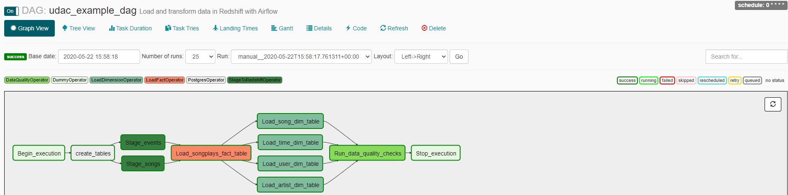
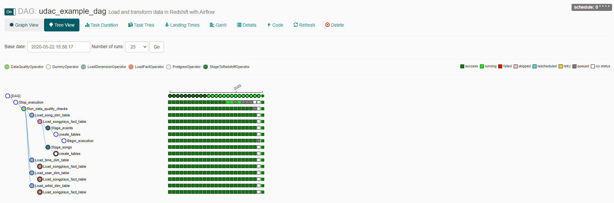
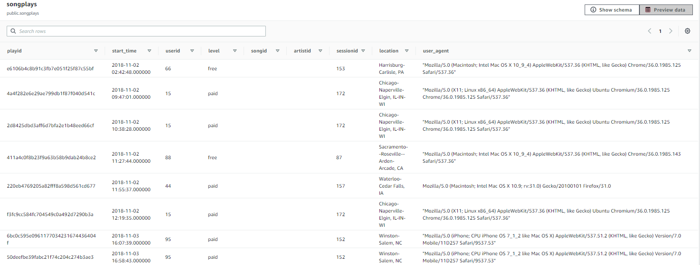
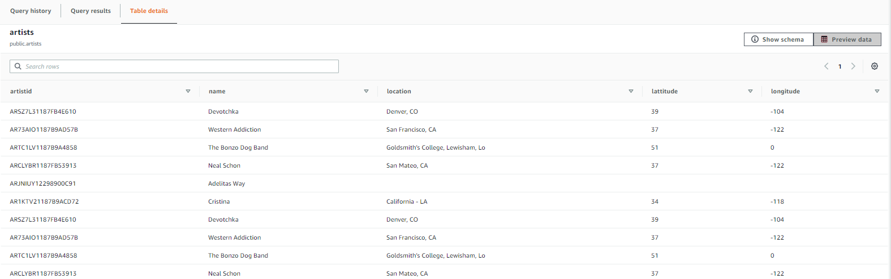
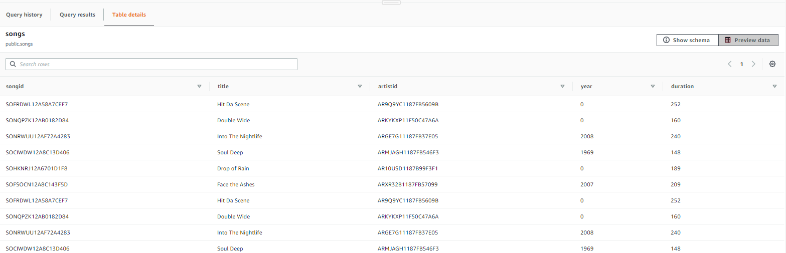
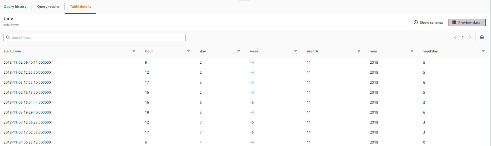
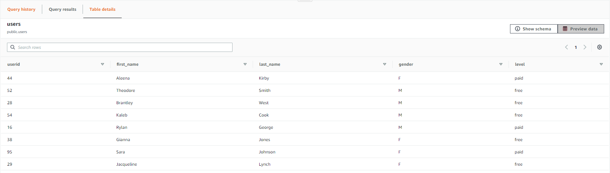

# Summary of the Project 

In this project, we will help a music streaming startup, Sparkify, to achieve automation and mointoring their data warehouse ETL pipeline through Apache Airflow. Specifically, in this project, we need to 
- Create custom operators to perform tasks such as staging the data, filling the data warehouse, and running checks on the data. 
- Utilize Airflow's built-in functionalities as connections and hooks as much as possible and let Airflow do all the heavy-lifting when it is possible.
- All of the operators and task instances will run SQL statements against the Redshift database. However, using parameters wisely will allow you to build flexible, reusable, and configurable operators you can later apply to many kinds of data pipelines with Redshift and with other databases.
- The SQL transformations are in a helper class that are prvoided. 

They have two types of datasets, both are located in AWS S3 buckets
1. Song Dataset: this is a subset of real data from the Million Song Dataset. Each file is in JSON format and contains metadata about a song and the artist of that song. The files are partitioned by the first three letters of each song's track ID. 

   Example of file `s3://udacity-dend/song_data/A/B/C/TRABCEI128F424C983.json` 
   contains `{"num_songs": 1, "artist_id": "ARJIE2Y1187B994AB7", "artist_latitude": null, "artist_longitude": null, "artist_location": "", "artist_name": "Line Renaud", "song_id": "SOUPIRU12A6D4FA1E1", "title": "Der Kleine Dompfaff", "duration": 152.92036, "year": 0}`
   
2. Event log Dataset: These are log files in JSON format generated by this event simulator based on the songs in the dataset above. These simulate app activity logs from an imaginary music streaming app based on configuration settings.The log files in the dataset are partitioned by year and month.

    Example of file `s3://udacity-dend/log_data/2018/11/2018-11-12-events.json`
    contains
    

The source data resides in S3 and needs to be processed in Sparkify's data warehouse in Amazon Redshift. The source datasets consist of JSON logs that tell about user activity in the application and JSON metadata about the songs the users listen to.

# Project Setup and Steps
1. Modify sql queries (if necessary) to create tables in `create_tables.sql`. 
	a. Added create of `time` table. 
    b. Move `create_tables.sql` to DAGs folder.
    c. Change to 'CREATE TABLE IF NOT EXISTS' to prevent "Table already exist" error
2. Complete code in operator files
	a. operator to copy data from S3 to Redshift: `plugins/operators/stage_redshift.py`
    b. load data from Redshift staging tables to fact table `plugins/operators/load_fact.py`
    c. load data from Redshift staging tables to dimenstion tables `plugins/operators/load_dimension.py`
    d. Data quality check to data has inserted into the tables
3. Complete code in Dag file `udac_example_dag.py`
	a. Define default args and Dag
    b. Complete all subdags
    c. Define task dependencies
    d. Add another task ("create_tables") after begin
4. In terminal, run command `/opt/airflow/start.sh`, then click "ACESS AIRFLOW" in workspace
5. Add Airflow Connections to AWS as per the instructions in the project 
6. In Airflow, turn the DAG on, and run it. Fixed bugs if task turned yellow ("UP for retry") or red ("failed")

# Explanation of the files in the repository
- `dags/udac_example_dag.py`: has all the imports and task templates in place, define airflow parameters and setup dependencies 
- `create_tables.sql`: sql queries for create tables.
- `plugins/helpers/sql_queries.py`: helper class for the SQL transformations
- `plugins/operators/stage_redshift.py`: stage operator definition. The stage operator is expected to be able to load any JSON formatted files from S3 to Amazon Redshift. The operator creates and runs a SQL COPY statement based on the parameters provided. The operator's parameters should specify where in S3 the file is loaded and what is the target table.
- `plugins/operators/load_fact.py`: fact operator definition. With dimension and fact operators, you can utilize the provided SQL helper class to run data transformations. Most of the logic is within the SQL transformations and the operator is expected to take as input a SQL statement and target database on which to run the query against. You can also define a target table that will contain the results of the transformation. Fact tables are usually so massive that they should only allow append type functionality.
- `plugins/operators/load_dimension.py`: dimension operator definition. With dimension and fact operators, you can utilize the provided SQL helper class to run data transformations. Most of the logic is within the SQL transformations and the operator is expected to take as input a SQL statement and target database on which to run the query against. You can also define a target table that will contain the results of the transformation. Dimension loads are often done with the truncate-insert pattern where the target table is emptied before the load. Thus, you could also have a parameter that allows switching between insert modes when loading dimensions.
- `plugins/operators/data_quality.py`: The final operator to create is the data quality operator, which is used to run checks on the data itself. The operator's main functionality is to receive one or more SQL based test cases along with the expected results and execute the tests. For each the test, the test result and expected result needs to be checked and if there is no match, the operator should raise an exception and the task should retry and fail eventually. For example one test could be a SQL statement that checks if certain column contains NULL values by counting all the rows that have NULL in the column. We do not want to have any NULLs so expected result would be 0 and the test would compare the SQL statement's outcome to the expected result.
- `img` folder: includes supporting images used in this markdown file.

# Final results
## DAG completed. Below are the Graph view and Tree view showing completion.

## Table created and data inserted in Amazon Redshift

